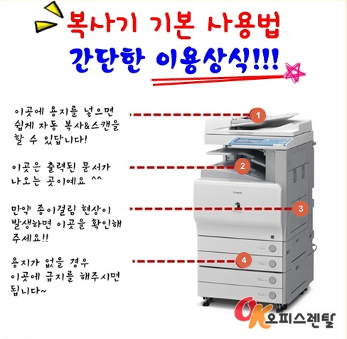
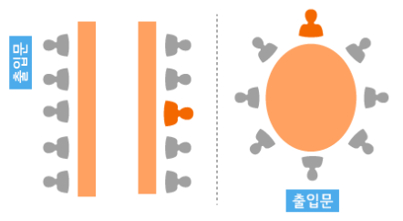
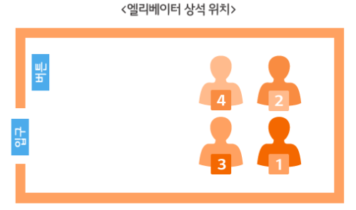
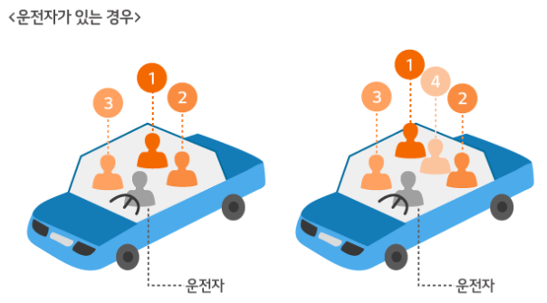
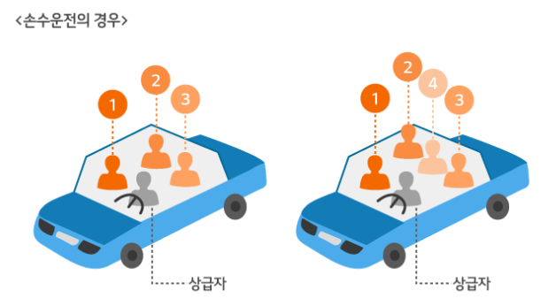

# 태도

## ★ 일이 주어지면, 모든 것을 보여주지 말되, 천천히 단단하게 하라.

* 일 하나가 주어지면, 하나를 하더라도 확실하게 하자.
  * 작은 것 하나라도 확실히 해야, 일을 주는 선배들의 입장에서 다음에 큰 걸 줘도 되겠다는 생각이 든다.
  * 오타부터 시작해서 작은 것 하나라도 확실히 해나가는 버릇을 길들여야한다.
  * 최대한 여러번 검토하라.
* 주어진 일에 대해서 그 이상을 하려하지 말자. 내 능력을 아껴서 보여줘야 한다.
* [관련 링크](https://www.youtube.com/watch?v=rGhSH6itEeQ)

## ★ 근태가 정말 중요하다. : 출근은 무조건 30분 일찍하자.

* 출근시간보다 30분 일찍 출근하라. 
  * 일찍 출근을 해서 업무를 할 수 있는 준비를 하자.
* 퇴근시간에는 상사의 눈치를 보가며 눈치껏 퇴근하자.  

## 사내에서 멘토를 찾아라.

* 멘토를 찾기 위해서 사내에 있는 많은 사람들을 알아가야 한다.
* 그러기 위해서 사람들과 대화하고 다가가는 것에 두려워하지 말자.

## 신입사원의 특권 : 아무리 쉬운 것이라도 물어보고 배울 수 있다. 

* 지시했는데 잘 모르겠으면 다가가서 물어보자.
* 최대한 물어보고 하나하나 내 것으로 만들자. 

## 가장 꼴불견 신입사원 행동

* 1위 잦은 지각
* 2위 인사 안하기
* 3위 업무시간 잦은 휴대전화 이용
* 4위 잦은 업무 실수
* 5위 상사에게만 잘하기

## ★ 인사를 잘하자. 강조해도 지나치지 않는다!

* 아침인사가 가장 중요하다.
  * 모든 사람들에게 들리도록 인사하자.
  * 그리고 내 자리에 짐을 놓고 내 부서에서 가장 높은 사람에게 가장 먼저 인사를 한뒤에 자리에 돌아오면서 자리에 있는 사람들에게 인사하라.
  * 일찍 출근해서 부서장이 출근하지 않은 경우 : 사람들이 오면 자리에 일어서서 인사하라.
    * 출근시간 근처거나 이후에 출근하시면 들어오자마자 이목이 집중되도록 인사하지 말고, 조용하게 인사드리기.
* 업무중 : 목례나 조그만 목소리로 인사하기.
  * 우리 부서 사람이든 아니든 무조건 인사하기.
  * 화장실간다거나 복도와 같이 눈이 마주치는 경우 어떤 부서 사람이든 가벼운 목례정도.
* 퇴근할때 : 명확하게 인사하자.

## 초기에는 무조건 부서사람들과 점심은 같이 먹자.

* 첫날은 동기들과 함께 먹는 것보다 부서 사람들과 무조건 같이 먹자. 

## 항상 메모하자.

* 전체적으로 프로젝트가 어떤 방식으로 진행되는지를 개괄해야한다. 
* 나와 관련이 없는 문서라 할지라도 전체 프로젝트에 관련되는 문서들을 봐야한다. 
* 선배들이 만들어 놓은 코드를 직접 보면서 연구하라. 

## 정리정돈

* 나의 자리를 정리하는 것.
* 나의 자료를 바탕화면에 주르륵 나열하는 것이 아니라 정리를 해서 집어넣어라.
* 즉시 즉시 꺼내야하는 자료는 바탕화면에 놓아라.
* 소스코드도 아주 깔끔하게 작성해야한다. 
  * 빨리 작성하고 나중에 정리해야지라는 마인드는 옳지 않다.
  * 시간이 걸리더라도 그때그때 깔끔하게 소스를 작성해나가자. 
  
## 최대한 늦게 건방져저라.

* 빨리 성장하기 때문에 자기가 많이 아는 것처럼 보일 수 있다.
* 그래서 선배들이 하는 것이 마땅치 않아 보일 수 있지만 그래도 최대한 늦게 건방져저야 한다.

## 꾸지람을 들었을때, 절대로 책임을 전가하지 말자.

* 큰 일이든, 작은 일이든, 그리고 그 일을 다른 사람이 해주든 안해주든, 그 일의 책임자가 나라는 사실을 잊지 말자.
* 따라서 절대로 책임을 전가해서는 안된다.

## 필기구와 펜은 항상 몸에 지니자.

* 업무를 배우거나, 상사이름, 중요한 사항을 필기해야 하는 경우가 비일비재하므로 항상 필기구와 수첩을 준비해서 메모하는 습관을 가져야 한다.

# 인사

## 인사태도

### 보는 순간 무조건 인사하자. 

* 보는 내가 먼저 한다는 생각으로 먼저 다가가는 것이 가장 큰 포인트이다. 
* 보는 순간 무조건 인사하자. 

### 엉덩이 떼고 인사하자.

### 우리 부서 사람들에게만 인사하는 것이 아니라, 회사 안의 모든 사람들에게 인사하자.

### 화장실에서 조용히 목례하고 자연스레 볼일을 보면 된다.

* 화장실에서 15도를 굽혀 몸을 숙여 인사를 하는 것은 볼일을 보고 있는 분께 실례이다.

### 멀리서 상사가 오는 것을 보았을때, 눈이 마주치는 순간 인사하라.

### 나와 단독으로 마주치는 경우가 아닌 경우에는 목례만 한다.

* 예를 들면 다른 분과 대화를 하는 중이거나 통화를 하는 중일때가 있다.

### 출,퇴근 길에 대중교통에서 상사를 뵙는 경우에도 무조건 인사하자.

## 인사자세

### 인사말을 하고(눈인사를 한 다음에) 인사를 하라.

### 고개를 숙이고 1~2초를 마음속으로 센 뒤에 일어나라.

* 용수철로 튀어오르는 인사는 건방져 보일 수도 있다.

### 달걀을 쥐은 손을 바지봉지에 붙이고 인사한다.

### 고개만 까딱하지 말고, 항상 인사말을 붙인다.

* 고개만 까딱하거나, 다른 팀원이라도 모른 척 하고 지나가게 되면 좋은 평가를 받을 수 없다.

## 인사말

### (소개인사) 안녕하십니까. ** 부서에 배정받은 신입사원 @@@입니다. 항상 최선을 다하겠습니다.

* 자신이 배정받은 부서와 이름을 밝히는 것이 좋다.
* 너무 튀는 인사말을 준비하기 보다는 무난한 인사말이 좋다.

### (일반인사) 한번 인사를 한 분이면 목례만 하고, 모르겠다 싶으면 '안녕하세요'라는 인사와 함께 목례한다.

### (메일인사)

~~~
안녕 하세요! 이번에 입사한 신입사원 000 입니다.
좋은 회사 좋은 분들과 같이 일 할 수 있는 좋은 기회를 얻게 되어 기쁘게 생각하고 있습니다.
아직 분위기에 미숙하고 업무처리에 미흡하겠지만 잘 배워서 차차 회사에 큰 일조가 되도록 노력 하겠습니다.

####

[자기소개]
안녕하십니까. ** 부서에 배정받은 신입사원 @@@입니다.

[입사배경]
대학에서 방송영상학을 전공하고 우연한 기회로 무대조명 일을 시작하게 되었습니다. 
국립 공연장과 예술문화기관에 조명감독으로 소속되어 일하 다 운이 좋아 부산 KBS홀 관리 담당자로 들어오 게 되었습니다. 

[입사포부]
신입사원으로서 아직 회사에 대해 모르는 것이 많고 부족한 점들이 많습니다. 선배 님들의 노하우와 경험을 스펀지처럼 흡수하여 보 다 안전하고 좋은 공연을 위해 노력하고 힘쓰도록 하겠습니다.
~~~

### `수고하셨습니다. 수고하세요`라는 인사말은 피하고 대신 `내일 뵙겠습니다.`

* 수고하셨습니다 라는 말은 윗사람이 아랫사람에게 하는 말이기 때문이다. 

## 복도

* 3보 앞에서 인사하라.

## 화장실

* 용무가 끝난 다음에 인사하라.
* 조용히 인사드려라.

## 퇴근

* '내일 뵙겠습니다, 먼저 가겠습니다.'
  * '수고하십시오, 고생하십시오'는 지양하자.

# 출근

## 첫출근시간 40분전이 적당하다.

* 일찍가서 회사 전체 분위기를 파악하는 것이 중요하다.
* 그리고 일찍 출근하는 사람일수록 근태에 예민하신 상사분일 확률이 높으니, 상사분들의 성향을 파악하는데 유리하다.

## 일반출근시간은 사수출근시간 - 5분.

* 그래서 첫출근에 일찍가서 맞선임이 되실분의 출근시간을 파악해놓는 것이 중요하다.

# 복합기 사용법

## 용지에 스테이플러로 묶여있는 경우, 원활한 복사/스캔을 위해서 제거여부를 여쭤본다.

* 스테이플러로 용지들이 묶여있는 경우, 복사와 스캔하기가 힘들다. 
* 제거가 가능한지를 복사/스캔하기 전에 여쭤보는 것이 좋다.

## 복사하는 방법

* 1번 부분에 복사/스캔할 부분이 윗면을 향하도록 가지런히 정렬해놓는다.
* 모니터에서 복사항목을 선택한다.
* 각종 세부옵션을 설정한다.
  * 복사부수 : 일반적으로 바로 다이얼버튼을 누르면 입력된다. 
  * 용지크기 : 적절한 용지 크기를 선택한다. 일반적으로 A4.
  * 확대/축소배율 : A4용지 크기의 원본을 A3용지로 복사하거나(확대), 책 두면을 A4용지 크기로 복사할때(축소) 이용한다.
    * 확대/축소 배율이 100%(A4용지 크기의 원본을 A4용지에 복사한다)처럼 적혀있다.
* 시작버튼을 누르면 복사가 진행된다.

### 확대/축소배율 : 용지에 맞게

* 어떤 크기를 가진(A4크기든 A3크기이든) 원본을 기본용지(A4)크기의 용지위에 복사해준다는 의미이다.

## 스캔하는 방법

* 1번 부분에 복사/스캔할 부분이 윗면을 향하도록 가지런히 정렬해놓는다.
* 모니터에서 스캔항목을 선택한다.
* [복사하는 방법](#복사하는-방법)과 마찬가지로 각종 세부옵션을 설정한다.
* 시작버튼을 누르면 스캔이 진행된다.
* 스캔이 완료되면, 이 내용을 어떤 이메일에 전송할지 나오며, 여기에 수신자의 이메일을 넣어주면 완료된다.

### 스캔결과를 일단 나에게 보내서 스캔결과를 확인하고, 이를 원래 수신자에게 전달한다.

* 이메일의 전달기능을 이용하여 수신자에게 전달한다.

# 질문예절

## `이게 맞나요?` 라고 끝나는 질문을 하자.

* 궁금한 것에 대해서 내가 해결책을 찾아본다.
* 해결책을 알 수 없다면, 해결방법을 추론한다.
  * unpaged pool을 조사하는 과정에서 커널오브젝트가 올라간다고 했는데, 프로세스 스케쥴러나 프로세스 아이디 내용을 말하는 것 같다는 생각을 했는데요. 제 생각이 맞을까요?
  
## 면접질문 대비한 것처럼, 질문을 한번 시뮬레이션(입으로 내뱉고) 질문드리자.

## 질문을 하러 갈때, 메모지를 가져가고, 답변을 들으면서 메모지에 적는다.

# 명함예절

## 명함 건네기 

### 서열이 낮은 사람이 먼저 건넨다.

* 명함은 서열이 낮은 사람이 먼저 건넨다.
* 단, 다른 회사에 방문했다면 지위와 관계없이 방문한 사람이 먼저 건네는 것이 좋다.

### 명함을 두 손으로 건넨다.

### 상대 방향으로 돌려서 전달한다.

* 상대방이 명함을 바로 확인할 수 있게 하기 위함이다. 

### 전달할때 상대방과 눈을 맞추며 이름과 소속을 말하는 것이 좋다.

## 명함 받기

### 상대방 서열이 낮더라도 일어서서 받는 것이 예의이다.

### 내 손가락이 상대방의 이름을 가리지 않게 받는다.

### 명함을 두 손으로 받는다.

### 상대방 앞에서 명함을 바로 넣지 말아야 한다.

### 명함을 교환할때는 일어서서 교환해야 한다.

## 명함 관리

### 리멤버 어플을 이용해서 명함을 관리해보자.

* [다운로드 링크](https://play.google.com/store/apps/details?id=kr.co.rememberapp&hl=ko)

# 악수예절

## 악수는 오른손으로 하는 것이 예의이다.

## 악수는 상급자가 먼저 청한다.

## 악수를 할때는 일어서서 해야한다.

## 악수를 할때 주머니에 손을 넣지 않는다. 

# 엘리베이터 예절

## 엘리베이터 벽에 기대지 않는다.

## 무리하게 타지 말자

## 뒤에 오는 사람을 위해서 문닫기버튼을 자제하자.

## 상사가 먼저 탈때까지/내릴때까지 엘리베이터의 문을 잡아주고, 엘리베이터를 타자.

# 전화예절

## `여보세요`하지말고, `안녕하십니까. 이스트게임즈 000팀 김홍규입니다.`

* 소속 직급 이름을 시작으로 전화를 받아야한다.

## 담당자가 부재중인 경우, 메모 : 발신자(소속, 이름, 전화번호) 수신자 용무

* 담당자가 부재중인 경우, 위 3가지를 메모해주면 좋다.

## 통화를 끊기전에 관련 내용을 재확인하자.

* 상대방이 시간이나 전화번호 같은 숫자나 고유명사를 말할때는 메모를 한 후 상대방에게 다시 한번 확인하자.

## 먼저 끊지 않기

* 전화를 건 사람이 용건이 끝난 것인지 확실하게 알 수 있는 방법이다. 

## 부재중인 경우, 전화를 당겨받아 내용을 메모하여 자레이 없는 동료에 전달한다.

* 따라서 사수에게 전화를 당겨받는 방법을 미리 물어보는 것이 좋다.

# 상석예절

## 회의실

### 출입구에서 먼쪽이 상석이다.

* [그림출저 : lgblog](http://www.lgblog.co.kr/life/37533)

### 스크린을 마주보는 쪽이 상석이다.

* [그림출저 : lgblog](http://www.lgblog.co.kr/life/37533)

## 엘리베이터

### 조작버튼의 대각선 안쪽이 상석이다.

* [그림출저 : lgblog](http://www.lgblog.co.kr/life/37533)

## 자동차

### 운전자(기사)가 있는 경우, 조수석 뒷자리가 상석이다.

* [그림출저 : lgblog](http://www.lgblog.co.kr/life/37533)

### 상급자가 손수운전하시는 경우, 조수석이 상석이다. 

* [그림출저 : lgblog](http://www.lgblog.co.kr/life/37533)

### 3인이면 운전자(기사)가 있는 경우 조수석, 손수운전하시는 경우 뒷자리석에 앉아야 한다.

### 4인이면 항상 뒷자리의 가운데 자리에 앉아야 한다.

# 식사예절

## 먹고싶은 메뉴 질문엔 '아무거나'만 아니면 아무거나 좋다.

* `아무거나 좋습니다. 드시고 싶은 것 드세요 저는 다 좋습니다.`와 같은 대답은 피하라.
* 메뉴범위를 최대한 구체적으로 정해서 대답하여 메뉴 선택의 폭을 줄여 상사의 고민을 덜어주자.

## 되도록이면 다른 사람들과 함께 점심을 먹어라.

* 그냥 지나칠지도 모른느 평생의 인연을 만날 수도 있고, 접해보기 어려운 필드의 회사소식을 들을 수도 있다.

## 수저, 물컵, 물수건은 직급 순서로 배치한다.

## 밑반찬이 셀프인 가게에서는 밑반찬도 마찬가지로 세팅,리필한다.

## 상사와 식사하는 속도를 유지한다.

# 업무메일

## 개인메일과 업무용메일은 구분하자.

* 자사 도메인으로 된 이메일 주소를 사용하는 경우가 많고, 이메일 주소 양식까지 정해놓은 곳이 많다.
* 그렇지 않다면, 업무용 메일을 따로 만들어서 사용한다. 
  * 개인메일을 업무용메일로 이용하면 스팸메일 속에서 중요한 업무 메일을 놓치는 불상사가 발생할 수 있기 때문이다./
  
## 업무용 메일 아이디 예시 : hk.kim@estgames.com

* 길지 않게 4~10자 정도로

## \[제목] 메일제목은 인사 or 업무성격이 나타나도록

* 처음 : 안녕하세요 00기업 xxx대리입니다. 제휴 관련 문의드립니다.
* 이후 : ㅁㅁ기업 광고 비용 정산건

## \[본문 상단] 본인과 수신자 확인

* 안녕하세요. ㅁㅁ기업 ㅁㅁㅁ님. 00기업의 000입니다.

## \[본문 하단] 마무리인사와 당부내용

* 답신이 필요 없을때 : 기본인사와 '특이사항이 없다면 따로 답변은 하지 않으셔도 됩니다.' 기입
* 답신을 원할 떄 : '수고스럽지만 답신해주시면 고맙겠습니다.'
* 확인과 검토를 요청할 때 : '확인 부탁드립니다.' '검토 부탁드립니다.'

## RE: 답장은 최소화할 것

* 메일로 내용을 주고받다 보면 답장을 이용할 경우가

# 회식예절

## 주도

### \[술병을 잡을때] 라벨을 가리고, 라벨이 보이지 않는 부분이 상대에게 보이도록 잡는다.

### \[술을 따를때] 손목, 팔꿈치를 잡고 따른다.

* 늘어나는 한복을 잡아주는 것에서 유래되었다.
* 거리가 가까우면 손목, 멀수록 팔쪽으로 내려오며 잡는다. 

### \[술을 따를때] 항상 7부를 따른다.

* 술잔의 70%를 따르면 된다. 
* 많이 따르지 말고 70%에 근접하되 그보다 적게 따르면 좋다.

### \[술을 받을때] 손목, 팔꿈치를 잡고 받는다. 

* 술을 따를때와 마찬가지이다.

### \[술을 마실때] 첫잔은 원샷이되, 나머지는 대장님에 맞춰가며 마시되, 주량을 넘어서면 멈춘다.

* 대장님이 원샷하시면 나도 원샷하고, 꺾어마시면 나도 꺾어마신다. 

### \[건배할때] 상사와 건배할때, 잔을 밑으로 깔고 건배한다. 

### 대장님으로부터 거리가 먼 쪽으로 고개를 돌려 마신다.

## 건배사

### 선창과 후창을 먼저 제안하고 건배사를 하는 것이 좋다.

* 제가 이스트게임즈를~이라고 하면 위하여~라고 말씀해주십시오.

### 이스트

* 이 : 이렇게
* 스 : 슨배님들과 
* 트 : 트아오르는 열정으로 열심히 하겠습니다.

### 이스트게임즈

* 이 : 이렇게
* 스 : 슨배님들과
* 트 : 트아오르는 열정으로 
* 게 : 게임을 만드는데
* 임 : 임할 것이고
* 즈 : 즈응말로 열심히 하겠습니다. 

# 할 게 없다면...

## 부서사람들부터 소속 직급 이름을 외운다. 

## 업무폴더를 정리한다.

